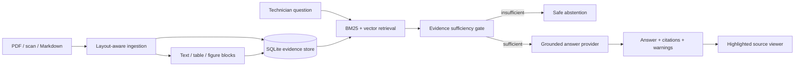

# ProofRAG

ProofRAG is an evidence-first multimodal troubleshooting assistant built for the **ABB Accelerator 2026 — Multimodal Maintenance Intelligence Agent** theme. It ingests maintenance manuals and service bulletins, retrieves relevant text/tables/figures, and answers only when the indexed evidence is strong enough. Every supported answer carries inspectable citations; weak evidence produces an explicit abstention.

> Verified 2026-09-26: the locked environment is installed; the synthetic PDF pack seeds successfully; 30 tests, lint, strict type checking, lock checking, and the 25-case locked evaluation pass. The repository is configured with an `origin`; the recorded demo, final link checks, and submitted tag remain outstanding.

## Product capabilities

- PDF, Markdown, and plain-text ingestion.
- Layout-aware PDF text blocks with page bounding boxes.
- Optional OCR fallback through PyMuPDF/Tesseract.
- Table extraction and figure/caption indexing.
- Transparent hybrid BM25 + local hashing-embedding retrieval.
- Exact equipment-model, manual-version, and selected-document filters.
- Evidence sufficiency gating based on discriminative coverage, exact identifiers, and absolute similarity—not the query-relative ranking score alone.
- Extractive offline answer mode requiring no external AI service.
- Optional OpenAI-compatible grounded answer generation.
- Page-level and region-level citations with highlighted PDF previews.
- Source-derived safety prerequisites, safeguard-bypass refusal, data-minimized query audit records, and a repeatable evaluation harness.
- Responsive technician-oriented web interface.

## Repository map

```text
.
├── pyproject.toml                 # uv/Python project definition
├── uv.lock                        # exact cross-platform dependency resolution
├── src/proofrag/
│   ├── api.py                     # FastAPI application and routes
│   ├── ingestion.py               # PDF/text/table/figure extraction
│   ├── retrieval.py               # hybrid retrieval
│   ├── answering.py               # grounded answer providers and evidence gate
│   ├── service.py                 # query orchestration and citations
│   ├── evaluation.py              # repeatable evaluation runner
│   └── static/                    # evidence-first web interface
├── data/
│   ├── demo-corpus/               # clearly labeled synthetic manuals
│   └── evaluation/                # golden questions
├── tests/                         # unit and integration tests
└── docs/                          # hackathon submission deliverables
```

## Run the demo

Prerequisite: [uv](https://docs.astral.sh/uv/).

```powershell
# Install the locked application and development dependencies.
uv sync --locked

# Index the bundled synthetic demonstration corpus.
uv run --locked python scripts/build_demo_pdfs.py
uv run --locked proofrag-seed

# Start the application.
uv run --locked proofrag
```

Open `http://127.0.0.1:8000`. Stop the server with `Ctrl+C`.

The two demo documents are synthetic and intentionally do not describe any real ABB equipment. Exercise all three primary demo paths:

1. `What should I inspect when fault E-17 appears, and what safety step comes first?`
2. `How frequently should the PX-200 cooling filter be inspected in a dusty woodworking site?`
3. `What refrigerant type and charge mass does the PX-200 use?`

## Evaluation and quality commands

Run these only after `uv sync --locked`:

```powershell
uv lock --check
uv run --locked pytest
uv run --locked ruff check .
uv run --locked mypy src
uv run --locked proofrag-evaluate
```

Expected current results are 30 passing tests and 25/25 authored locked evaluation cases. The evaluation report is written to `data/evaluation-results/latest.json` and is ignored by version control. The development and locked sets contain 25 cases each; the original six-case file is retained only as a smoke fixture. Rerun evaluation after committing so the report records a clean submitted revision.

## Configuration

Copy `.env.example` to `.env` and change only the values needed locally.

### Offline/default mode

```dotenv
PROOFRAG_ANSWER_PROVIDER=extractive
```

This mode performs no external API call. It extracts the most relevant evidence, attaches citations, and abstains below the configured threshold.

### OpenAI-compatible mode

```dotenv
PROOFRAG_ANSWER_PROVIDER=openai-compatible
PROOFRAG_LLM_BASE_URL=https://your-compatible-endpoint/v1
PROOFRAG_LLM_API_KEY=replace-me
PROOFRAG_LLM_MODEL=replace-me
```

The generator receives only the retrieved evidence and is instructed to cite every claim. Retrieval, evidence gating, citations, and safety warnings remain application-controlled. Missing/out-of-range citations, uncited content lines, unsupported identifiers/numbers, or incorrect safety ordering trigger the deterministic extractive fallback.

### OCR

Set `PROOFRAG_ENABLE_OCR=true` to enable PyMuPDF's OCR fallback for scanned pages. This requires a compatible Tesseract installation on the host. Without it, scanned pages produce an ingestion warning rather than silently fabricating text.

## API surface

| Method | Path | Purpose |
|---|---|---|
| `GET` | `/api/health` | Service, corpus, and provider status |
| `GET` | `/api/documents` | List indexed evidence sources |
| `POST` | `/api/documents` | Upload and index PDF/TXT/Markdown |
| `POST` | `/api/ask` | Ask a grounded maintenance question |
| `GET` | `/api/documents/{id}/pages/{page}/image` | Render a PDF page with optional evidence highlight |

Interactive API documentation is available at `/docs` while the app is running.

## Architecture



## Trust model

- Retrieved document content is treated as untrusted data, not application instructions.
- Ranking orders evidence, while a separate gate checks absolute term coverage, requested identifiers/numbers, model/version applicability, and similarity.
- Citations are constructed by the application from retrieved records, not invented by the model.
- Safety notices are displayed separately from manual-derived evidence.
- Original page coordinates are retained for inspection.
- Uploaded content remains local by default. Audit rows store a question hash, not raw question or answer text.

## Current limitations

- The bundled hashing embedder is a deterministic offline baseline, not a production semantic model.
- Figure understanding currently indexes the figure region and nearby caption; a vision-language provider is a documented extension point.
- Version handling is visible and filterable; there is no generic automatic precedence engine.
- OCR depends on host Tesseract availability.
- SQLite retrieval is intended for a prototype corpus; production scale should move vectors to Qdrant/pgvector and artifacts to object storage.
- The application supports maintenance research and navigation; it is not authorized to control equipment or replace qualified technicians.

## Deliverables

- [Submission form copy](docs/SUBMISSION_FORM.md)
- [Canonical project and competition guide](docs/PROJECT_GUIDE.md)
- [Project summary](docs/PROJECT_SUMMARY.md)
- [Technical documentation](docs/TECHNICAL_DOCUMENTATION.md)
- [Evaluation plan](docs/EVALUATION_PLAN.md)
- [Demo video script](docs/DEMO_VIDEO_SCRIPT.md)
- [Presentation deck content](docs/PRESENTATION_DECK.md)
- [Complete design-AI report brief](docs/DESIGN_AI_REPORT_BRIEF.md)
- [Submission checklist](docs/SUBMISSION_CHECKLIST.md)
- [Responsible AI and threat model](docs/RESPONSIBLE_AI.md)
