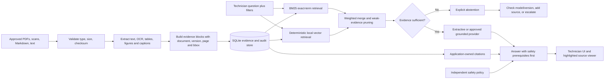

# ProofRAG Complete Report and Design-AI Brief

## Purpose

This document is the single source of truth for turning ProofRAG into a polished ABB Accelerator 2026 idea report or presentation. It is written so the complete file can be uploaded to Claude Design, Canva, Gamma, Figma AI, or another design tool without requiring the tool to invent product facts.

The primary deliverable is a **three-page A4 portrait idea report**, matching the information hierarchy of the provided `ABB_Accelerate_2026_Inspiration_Guide` examples. A compatible ten-slide pitch-deck specification follows it.

## Project identity

**Project title:** ProofRAG: Evidence-First Multimodal Maintenance Intelligence  
**Short product name:** ProofRAG  
**Tagline:** Maintenance answers you can verify.  
**Closing line:** Because the source is part of the answer.  
**Competition:** ABB Accelerator 2026  
**Selected theme:** Theme 2 — Multimodal Maintenance Intelligence Agent  
**Category:** Grounded troubleshooting and technical-document intelligence  
**Primary users:** Qualified maintenance technicians, maintenance engineers, field-service personnel, control-room personnel, and technical-support teams  
**Team name:** `[TEAM NAME]`  
**Team members and roles:** `[ADD NAMES, UNIVERSITY, AND ROLES]`

## Truth and claims rules

The design must preserve these distinctions:

- **Implemented in source:** document ingestion, structured evidence records, BM25 plus deterministic local-vector retrieval, manual/document filters, evidence gating, extractive answers, optional OpenAI-compatible answers, application-owned citations, safety notices, audit logging, PDF-region preview endpoint, web interface, synthetic demo corpus, and evaluation harness.
- **Runtime verified:** the locked environment, seed path, automated tests, lint, type checks, PDF preview API, and locked evaluation have run. See `docs/EVALUATION_PLAN.md` and `docs/HANDOFF.md` for bounded results and remaining external deliverables.
- **Results versus targets:** the post-fix 25-case locked synthetic run is measured; target tables and any real-pilot outcomes remain targets. Never blend the two.
- **Future scope:** full visual diagram reasoning, calibrated dense embeddings, automated bulletin precedence, production authentication, antivirus/content disarm, vector infrastructure, and technician feedback workflows.
- **Synthetic data:** the Sentinel PX-200 corpus is fictional and does not describe ABB equipment.
- **Human authority:** ProofRAG does not control equipment, approve maintenance, approve return to service, or replace site procedures and qualified personnel.

Do not use fabricated accuracy, downtime reduction, cost savings, customer adoption, or latency numbers. If the locked evaluation has not run, use a clearly labeled **Evaluation framework** visual rather than a performance chart.

---

# Part I — Three-page ABB-style idea report

## Document setup

- Format: A4 portrait, three pages, exportable to PDF.
- Grid: 12 columns with 18–22 mm outside margins.
- Style: modern industrial editorial design; restrained, high-trust, and technical.
- Density: comparable to the inspiration guide, but with stronger whitespace and shorter paragraphs.
- Reading order: context → solution → proof and adoption.
- Footer on every page: `ABB Accelerator 2026 · Theme 2 · ProofRAG · Synthetic demonstration corpus; not ABB equipment.`
- Page number format: `01 / 03`, `02 / 03`, `03 / 03`.

## Visual language

Use the current ProofRAG interface as the visual anchor:

- Primary red: `#E30613`
- Dark red: `#B8000A`
- Near-black: `#171515`
- Sidebar charcoal: `#201D1D`
- Warm canvas: `#F5F3F1`
- White panels: `#FFFFFF`
- Muted copy: `#686363`
- Hairline: `#E7E3E1`
- Safety amber: `#E2A300` on `#FFF6DF`
- Success green: `#087A35` on `#E7F8ED`
- Abstention red tint: `#FFF0F0`

Typography:

- Headlines: Inter, Helvetica Neue, Arial, or a close geometric sans-serif; heavy weight; tight tracking.
- Body: Inter, Source Sans 3, or IBM Plex Sans; regular weight; generous line spacing.
- Labels: uppercase, 10–11 pt, medium/bold, letter spacing around 0.10 em.
- Use tabular numerals for page, version, score, and threshold references.

Graphic motif:

- Evidence rectangles, numbered citation chips, document page outlines, bounding-box highlights, and a branching evidence gate.
- Three slightly slanted vertical bars may echo the current interface’s empty-state mark.
- Use clean line icons for document, table, figure, search, shield, citation, and technician.
- Do not use robots, glowing brains, generic chatbot bubbles, or fictitious ABB machinery.
- Do not use the ABB logo unless competition branding rules explicitly permit it. Text may say “ABB Accelerator 2026.”

## Page 1 — Problem, relevance, and team

### Page intent

Make the industrial trust problem immediately legible. The reader should understand that ProofRAG is not “chat with PDFs”; it is a controlled evidence workflow for maintenance decisions.

### Layout

1. **Top masthead, 12 columns, 12% of page**
   - Left: `IDEA 02 / THEME 2`
   - Center: `ABB ACCELERATOR 2026`
   - Right: `MULTIMODAL MAINTENANCE INTELLIGENCE AGENT`
   - Use a thin red rule below the masthead.

2. **Hero identity block, 12 columns, 18% of page**
   - Eyebrow: `EVIDENCE-FIRST INDUSTRIAL AI`
   - Title: `ProofRAG`
   - Subtitle: `Maintenance answers you can verify.`
   - One-line descriptor: `A multimodal troubleshooting assistant that returns cited guidance—or explicitly abstains when the evidence is insufficient.`

3. **Main two-column body, 8 + 4 columns, 52% of page**
   - Left: problem statement and relevance.
   - Right: team details, selected theme, primary users, and product boundary.

4. **Bottom strip, 12 columns, 18% of page**
   - Four “Why this matters” cards.

### Finished copy — problem statement and relevance

Industrial maintenance knowledge is fragmented across long manuals, scanned service bulletins, tables, diagrams, and versioned procedures. During a fault, technicians must determine not only what a document says, but whether it applies to the correct equipment, configuration, and manual revision.

Traditional keyword search misses relationships and exact procedural context. Generic AI assistants may produce plausible instructions without reliable evidence, blend conflicting versions, or cite text that does not support the answer. In a safety-sensitive environment, a fluent answer is not enough: the technician must be able to inspect the source, see its provenance, and recognize when the available documents cannot support a safe conclusion.

ProofRAG addresses this gap with one non-negotiable rule: **no evidence, no answer**. It retrieves applicable document evidence, preserves page and region provenance, presents safety prerequisites before intervention steps, and refuses unsupported questions. It assists qualified personnel while leaving site procedures and human authority in control.

### “Why this matters” cards

**01 — Fragmented knowledge**  
The applicable procedure may be split across a base manual, later bulletin, table, figure, and scanned page.

**02 — Version risk**  
A technically correct value can still be unsafe when it comes from an outdated or inapplicable document version.

**03 — Verification burden**  
Technicians need the exact page, source type, and highlighted region—not an unsupported summary.

**04 — Missing evidence**  
When the corpus cannot answer, the correct product behavior is visible abstention and escalation.

### Right-rail content

**Selected theme**  
Theme 2 — Multimodal Maintenance Intelligence Agent

**Primary users**  
Maintenance technicians · Maintenance engineers · Field service · Technical support

**Team**  
`[TEAM NAME]`  
`[MEMBER — ROLE]`  
`[MEMBER — ROLE]`  
`[MEMBER — ROLE]`

**Product boundary**  
Decision support and source navigation only. No equipment control. No approval of maintenance or return to service.

### Page 1 visual

Create a restrained collage showing a manual page, a small table, a wiring-style line diagram, and a service bulletin. Connect each source to a single technician query. Place a red bounding box over one source region and a numbered citation chip beside it. Avoid photography unless the asset is licensed and clearly generic.

---

## Page 2 — Solution, workflow, features, and architecture

### Page intent

Show how ProofRAG turns documents into an inspectable answer and where its differentiation is enforced in the system.

### Layout

1. **Header, 12 columns, 10% of page**
   - Eyebrow: `IDEA AND APPROACH`
   - Title: `From source material to cited guidance`

2. **Solution overview, 12 columns, 18% of page**
   - Short narrative on the left.
   - Large pull quote on the right: `No evidence, no answer.`

3. **Six-step workflow, 12 columns, 20% of page**
   - A horizontal numbered chain with an abstention branch at step 5.

4. **Feature grid, 7 columns, 42% of page**
   - Six compact feature cards.

5. **Architecture stack, 5 columns, 42% of page**
   - Five vertically connected layers.

6. **Footer note, 12 columns, 10% of page**
   - `Default extractive mode keeps documents local and requires no hosted model.`

### Finished copy — solution overview

ProofRAG ingests PDF, scanned, Markdown, and plain-text technical documents and converts them into structured evidence blocks for text, OCR, tables, and figure/caption regions. Each block retains document identity, version, page, source type, and bounding box when available.

At query time, ProofRAG combines exact-term retrieval—important for fault codes, connector names, model identifiers, and numeric thresholds—with a deterministic local vector signal. An evidence-sufficiency gate decides whether an answer is permitted. Supported responses receive application-owned citations and visible safety notices; weak evidence produces an explicit abstention with no procedural citations.

### Six-step workflow

**1. Ingest**  
Validate and index approved manuals, scans, tables, figures, bulletins, Markdown, and text.

**2. Structure**  
Preserve document, version, page, source type, region coordinates, checksum, and extraction warnings.

**3. Retrieve**  
Combine BM25 with a replaceable local embedding signal and apply document, model, or version filters.

**4. Gate**  
Check retrieval strength and prune weak supporting evidence before answer generation.

**5. Answer or abstain**  
Return grounded guidance when supported; otherwise state that the indexed corpus is insufficient.

**6. Verify**  
Open a citation to inspect the original page and highlighted evidence region.

Branch below step 5:

`INSUFFICIENT EVIDENCE → ABSTAIN → CHECK MODEL/VERSION, ADD DOCUMENT, OR ESCALATE`

### Key feature cards

**Evidence-first answers**  
The answer is downstream of retrieved records and an explicit sufficiency gate.

**Application-owned citations**  
Citation IDs, document metadata, pages, source types, and regions come from indexed database records—not generated prose.

**Region-level verification**  
PDF bounding boxes support highlighted source previews so users can inspect the exact evidence area.

**Version-aware retrieval**  
Manual versions remain visible and filterable; the demo shows a later service bulletin superseding a base interval.

**Multimodal evidence model**  
Text, OCR, tables, and figure/caption regions share one retrieval and citation pipeline.

**Local-first operation**  
The deterministic extractive path works without sending documents to a hosted AI provider.

### Architecture stack

**A — Ingestion layer**  
File/type/size validation · SHA-256 duplicate detection · PyMuPDF layout extraction · optional Tesseract OCR hook · table and figure/caption extraction

**B — Evidence layer**  
Bounded chunks · normalized content · hashing embeddings · document/version/page/source metadata · bounding boxes · SQLite persistence

**C — Retrieval layer**  
BM25 exact-term scoring · local vector similarity · weighted score merge · document/model/version filters · weak-evidence pruning

**D — Grounding and safety layer**  
Evidence threshold · extractive or approved OpenAI-compatible provider · application-owned citations · independent safety notices · abstention

**E — Experience and audit layer**  
FastAPI · technician web interface · evidence support (not correctness probability) · citation cards · highlighted source viewer · data-minimized query audit trail

### Page 2 visual

Use a single architecture diagram, not decorative arrows. Show approved documents entering the ingestion layer on the left, a structured evidence store in the center, and the technician query on the upper right. The evidence gate must visibly branch to `CITED ANSWER` and `ABSTAIN`. Place citations and safety policy outside the optional model box to show that the application—not the model—owns them.

---

## Page 3 — Technical model, innovation, demo proof, impact, and roadmap

### Page intent

Demonstrate technical credibility, an honest validation plan, and a feasible path from prototype to bounded industrial pilot.

### Layout

1. **Header, 12 columns, 9% of page**
   - Eyebrow: `IMPLEMENTATION AND IMPACT`
   - Title: `Trust is designed into the pipeline`

2. **Top information row, 12 columns, 22% of page**
   - Three equal cards: model type, technical stack, demonstration proof.

3. **Middle row, 12 columns, 28% of page**
   - Left 7 columns: innovation highlights.
   - Right 5 columns: evaluation framework.

4. **Bottom row, 12 columns, 31% of page**
   - Left: expected business value.
   - Center: prototype-to-pilot roadmap.
   - Right: limitations and future improvements.

5. **Closing band, 12 columns, 10% of page**
   - Pilot ask and closing line.

### Model type card

**Model type**  
Hybrid lexical retrieval + deterministic local vector baseline + evidence-gated extractive answering. Optional hosted generation is replaceable and remains downstream of retrieval, grounding, and application-owned citation controls.

### Technical stack card

**Backend:** Python 3.12 · FastAPI · Uvicorn  
**Document processing:** PyMuPDF · optional Tesseract OCR  
**Retrieval:** BM25 · feature hashing · cosine similarity  
**Storage:** SQLite prototype evidence and audit store  
**Interface:** HTML · CSS · JavaScript  
**Packaging and quality:** uv · pytest · Ruff · mypy

Do not add React, LangGraph, Neo4j, FAISS, Qdrant, PostgreSQL, or a vision-language model to the current-stack list. Those are possible production migrations or future extensions, not current prototype dependencies.

### Demonstration proof card

**Synthetic PX-200 scenario**

1. **Supported fault:** E-17 retrieves lockout/tagout, absence-of-voltage, cooling filter, fan, and connector J4 evidence.
2. **Version conflict:** a later bulletin changes the dusty-site filter inspection interval from 500 hours to 250 operating hours or monthly.
3. **Safe abstention:** a refrigerant type and charge question is unsupported and receives no procedural answer.

Label this card: `SYNTHETIC DEMONSTRATION — NOT ABB EQUIPMENT`.

### Innovation highlights

**No-evidence/no-answer contract**  
Abstention is a first-class product outcome, not a fallback sentence added after generation.

**Citation authority outside the model**  
The application constructs citations from indexed records, preventing the answer provider from inventing source IDs or provenance.

**Inspectable spatial provenance**  
Document page coordinates survive ingestion and retrieval, allowing highlighted source inspection rather than citation-only trust.

**Safety before intervention**  
Independent warnings and evidence-derived prerequisites appear before procedural actions.

**Offline by default**  
The baseline path is deterministic and local; external AI is opt-in and receives only retrieved excerpts.

**Conflict and gap visibility**  
Version filters expose document applicability, while abstentions and query logs reveal missing documentation.

### Evaluation framework

Use a checklist or unfilled scorecard—never a chart implying measured success.

- Retrieval Recall@5 and mean reciprocal rank
- Version accuracy and source-type recall
- Expected-term coverage
- Faithfulness, citation precision, and citation completeness
- Unanswerable accuracy and false-answer rate
- Safety prerequisite ordering
- Median/P95 latency and indexing throughput
- OCR warning/failure rate and duplicate behavior

Caption: `Six smoke cases exist. Expand to at least 50 human-reviewed cases before making competitive performance claims.`

### Expected business value

- Shorter navigation time from a fault code to the applicable procedure.
- Fewer unsupported troubleshooting suggestions.
- Better auditability through visible source, version, page, and evidence region.
- Faster transfer of documented knowledge to less-experienced technicians without hiding the source.
- Earlier discovery of missing, conflicting, or outdated maintenance documentation.
- A lower-risk adoption path because the first pilot is read-only, bounded to approved documents, and has no equipment-control path.

Frame every item as an expected or intended outcome until measured in a real pilot.

### Prototype-to-pilot roadmap

**Stage 1 — Verified prototype**  
Run the locked environment, fix defects, capture screens, execute tests, and publish measured evaluation output.

**Stage 2 — Bounded pilot**  
Use one approved equipment family, immutable document versions, technician-authored questions, and human review.

**Stage 3 — Production hardening**  
Add identity and role access, encrypted object storage, PostgreSQL, filtered vector search, sandboxed ingestion, monitoring, and retention controls.

**Stage 4 — Controlled expansion**  
Evaluate dense industrial embeddings, vision-language diagram descriptions, knowledge graphs, automated applicability rules, and feedback workflows.

### Limitations and future improvements

- Figure support currently indexes regions and nearby captions; it is not full diagram reasoning.
- OCR depends on source quality and host Tesseract availability.
- The hashing embedder is a reproducible baseline, not a production semantic model.
- Version precedence is currently user-filtered; automated effective-date and applicability rules are future work.
- Evidence support is retrieval-derived, is not a correctness probability, and requires calibration on a larger independently reviewed set.

### Closing band

**Pilot ask:** Evaluate ProofRAG on one bounded equipment family using approved manuals and technician-authored questions, then expand only after citation and abstention targets are met.

**Final line:** `ProofRAG — because the source is part of the answer.`

---

# Part II — Architecture graphic specification

Recreate this diagram as editable vectors. Keep the two outcome branches visually equal so abstention reads as a successful safety behavior, not a system error.



Diagram rules:

- Put the optional provider inside a dashed box.
- Put citations, safety policy, and abstention outside that dashed box.
- Use red for the trusted evidence path, charcoal for infrastructure, amber for safety, green for supported output, and a pale red/neutral treatment for abstention.
- Annotate the store with `local by default`.
- Annotate the viewer with `document · version · page · source type · region`.

---

# Part III — Product-screen storyboard

Create or capture these six frames for the report, deck, or video. Do not fabricate screens with capabilities that are not in the interface.

## Frame 1 — Empty state

- Dark evidence-library sidebar.
- Headline: `Answers you can verify.`
- Query card with equipment model and manual version filters.
- Trust badge: `Evidence gated`.
- Three feature chips: `Hybrid retrieval`, `Region citations`, `Safe abstention`.

## Frame 2 — Indexed corpus

- Sidebar shows the synthetic base manual and service bulletin.
- Each source displays title, version, page count, and evidence-block count.
- Include a visible synthetic-corpus label.

## Frame 3 — Supported E-17 answer

- Question: `What should I inspect when fault E-17 appears, and what safety step comes first?`
- Safety warning appears before the answer body.
- Answer references lockout/tagout, absence of voltage, filter, fan, and J4 only if the live output supports those terms.
- Citation cards show page, version, source type, excerpt, and evidence score.

## Frame 4 — Source verification

- Evidence modal with document title, page, version, source type, excerpt, and a highlighted region on the original PDF page.
- Caption: `The technician can inspect the evidence, not just the answer.`
- If no PDF demo source exists yet, mark this frame `capture after PDF demo asset is added`; do not mock it as completed functionality.

## Frame 5 — Bulletin precedence

- Question: `How often should the cooling filter be inspected in a dusty woodworking site?`
- Show the service bulletin version 1.1 and the superseding `250 operating hours or monthly` requirement.
- Visually contrast it with the base manual’s `500 operating hours under normal indoor conditions`.

## Frame 6 — Abstention

- Question: `What refrigerant type and charge mass does the PX-200 use?`
- Title: `Insufficient evidence`.
- No citations.
- Warning: `No procedural action should be taken from this response.`
- Add an escalation cue: check equipment/model, add the applicable document, or consult an authorized source.

---

# Part IV — Ten-slide pitch-deck specification

Use 16:9 widescreen. Keep each slide to one conclusion, one main visual, and no more than 35–45 visible words excluding labels and footers.

## Slide 1 — ProofRAG

**Headline:** `Maintenance answers you can verify.`  
**Subhead:** `Evidence-first multimodal troubleshooting for ABB Accelerator 2026.`  
**Visual:** a document page with a red evidence rectangle flowing into a citation-backed answer.  
**Footer:** team names, university, and Theme 2.

## Slide 2 — The real problem is applicability

**Headline:** `Finding text is not the same as finding the right procedure.`  
**On-slide copy:** `Manuals, scans, tables, figures, and bulletins fragment the answer. Wrong versions and unsupported AI outputs turn search friction into maintenance risk.`  
**Visual:** fragmented source collage with a single ambiguous fault question.

## Slide 3 — Design contract

**Headline:** `No evidence, no answer.`  
**Five labels:** Retrieve first · Preserve provenance · Safety first · Abstain visibly · Human authority  
**Visual:** the evidence-gate branch.

## Slide 4 — How ProofRAG works

**Headline:** `One controlled path from document to decision support.`  
**Visual:** the six-step workflow: ingest → structure → retrieve → gate → answer/abstain → verify.  
**Callout:** `Citations are application-owned.`

## Slide 5 — Product experience

**Headline:** `The source stays beside the answer.`  
**Visual:** large supported-answer screen plus a smaller source-modal inset.  
**Three callouts:** version visible · safety warning first · highlighted evidence region.

## Slide 6 — Three-scene demonstration

**Headline:** `Supported. Superseded. Unsupported.`  
**Visual:** three columns.

- `E-17` — retrieve safety and inspection evidence.
- `Dusty site` — surface the later 250-hour/monthly bulletin.
- `Refrigerant` — abstain because the corpus has no support.

Footer: `Synthetic PX-200 corpus; not ABB equipment.`

## Slide 7 — Architecture and trust controls

**Headline:** `Grounding is enforced outside the model.`  
**Visual:** simplified architecture graphic.  
**Trust rail:** app-owned citations · region provenance · prompt-injection boundary · local default · audit log · no control path.

## Slide 8 — Evaluation framework

**Headline:** `We measure retrieval, grounding, and refusal—not fluency alone.`  
**Visual:** an unfilled or measured scorecard for Recall@5, citation precision, expected-term coverage, unanswerable accuracy, safety ordering, and latency.  
**Rule:** show measured values only after the locked evaluation has run and outputs have been reviewed.

## Slide 9 — Feasible adoption path

**Headline:** `Start bounded. Earn trust. Scale deliberately.`  
**Visual:** prototype → one-equipment-family pilot → production hardening → controlled multimodal expansion.  
**Small labels:** immutable source versions · technician-authored evaluation · access controls · vector/vision upgrades after validation.

## Slide 10 — Impact and ask

**Headline:** `Make industrial AI inspectable before making it bigger.`  
**Outcomes:** faster procedure navigation · fewer unsupported suggestions · better knowledge transfer · visible documentation gaps  
**Ask:** `Pilot ProofRAG on one approved equipment family.`  
**Closing line:** `Because the source is part of the answer.`

---

# Part V — Copy-paste prompt for Claude Design or another design AI

Paste the following prompt with this entire file attached:

```text
Create a polished three-page A4 portrait idea report for “ProofRAG: Evidence-First Multimodal Maintenance Intelligence,” an ABB Accelerator 2026 Theme 2 project.

Use the attached design brief as the only source of product facts and copy. Follow Part I page by page, recreate the Part II architecture diagram as editable vectors, and use the specified visual tokens. The aesthetic should feel like a credible industrial technology proposal: precise, restrained, editorial, high-contrast, and easy to scan. Use warm white space, charcoal, ProofRAG red (#E30613), thin rules, evidence-box motifs, citation chips, and safety/abstention states. Do not use robot imagery, glowing AI brains, fictitious equipment, or unlicensed ABB branding.

Do not invent team members, metrics, customers, screenshots, integrations, or business savings. Use only verified team details and the bounded synthetic-corpus evaluation results recorded in `docs/EVALUATION_PLAN.md`. Mark the PX-200 corpus as synthetic and not ABB equipment. Preserve the distinction between implemented and runtime-verified behavior, evaluation targets, measured synthetic results, and future work. Never describe ProofRAG as controlling equipment or replacing qualified personnel.

Page 1 must establish the fragmented-document, version, verification, and missing-evidence problem. Page 2 must explain the solution workflow, six differentiating features, and five-layer architecture. Page 3 must present the current stack, synthetic demonstration, innovation, evaluation framework, expected value, limitations, roadmap, and bounded-pilot ask.

Use all finished copy from the brief, editing only for fit and clarity. Keep body text readable at print size. Export an editable source file and a print-ready PDF. Also produce a 16:9 ten-slide variant using Part IV, but treat the three-page report as the primary deliverable.
```

## Recommended generation sequence

1. Generate only the three-page wireframe with text boxes and hierarchy.
2. Check that every required section is present and no invented fact appears.
3. Apply the visual system and architecture diagram.
4. Replace placeholders with verified team information.
5. Add real screenshots only after the locked application run.
6. Export PDF and review at 100% zoom for overflow, tiny text, and false claims.
7. Generate the ten-slide version from the approved report, not independently.

---

# Part VI — Supporting evidence and traceability

## Source map

| Report claim or section | Primary supporting source |
|---|---|
| Theme 2 selection and official challenge framing | `ABB_ACCELERATOR_2026_CHALLENGE_BRIEF.md`; official HackerEarth challenge page and themes data linked below |
| Inspiration-guide structure | `ABB_Accelerate_2026_Inspiration_Guide (3)6e63242.pdf`, especially the three-page Theme 2 example |
| Product promise, users, demo, boundaries | `docs/PROJECT_SUMMARY.md`, `docs/PROJECT_GUIDE.md` |
| Ingestion, retrieval, answer, citation, API, and storage design | `docs/TECHNICAL_DOCUMENTATION.md`; `src/proofrag/` |
| Safety, privacy, prompt injection, and human authority | `docs/RESPONSIBLE_AI.md`; `src/proofrag/safety.py`; `src/proofrag/answering.py` |
| Evaluation metrics, targets, and limitations | `docs/EVALUATION_PLAN.md`; `data/evaluation/questions.jsonl`; `src/proofrag/evaluation.py` |
| Synthetic E-17 and bulletin scenario | `data/demo-corpus/sentinel_px200_manual_v1.md`; `data/demo-corpus/sentinel_px200_service_bulletin_v1_1.md` |
| Demo sequence | `docs/DEMO_VIDEO_SCRIPT.md` |
| Current completion state | `docs/SUBMISSION_CHECKLIST.md`; `docs/PROJECT_GUIDE.md` |
| Existing visual tokens and UI structure | `src/proofrag/static/styles.css`; `src/proofrag/static/index.html` |
| Dependencies and current stack | `pyproject.toml` |

## Official competition references

- Challenge page: <https://www.hackerearth.com/community/challenges/hackathon/abb-accelerator-2026/>
- Event metadata: <https://www.hackerearth.com/challengesapp/api/events/abb-accelerator-2026/>
- Themes data: <https://www.hackerearth.com/challengesapp/api/events/abb-accelerator-2026/tabs/themes/>
- FAQ data: <https://www.hackerearth.com/challengesapp/api/events/abb-accelerator-2026/tabs/faqs/>

The live public page reviewed on September 16, 2026 lists teams of 1–5, the Idea Phase through September 18, 2026 at 08:00 UTC, and the Prototype Phase through September 27, 2026 at 21:59 UTC. The local challenge brief records a discrepancy between the platform metadata and a published visual timeline; use the earlier live platform cutoff.

## Final pre-export checklist

- [ ] Team name, member names, roles, university, and contact information are filled in.
- [ ] Theme is exactly `Theme 2 — Multimodal Maintenance Intelligence Agent`.
- [ ] Every mention of PX-200 says or clearly implies that it is synthetic and not ABB equipment.
- [ ] No measured metric appears unless it came from a reviewed locked evaluation run.
- [ ] Current dependencies/stack are not mixed with future production options.
- [ ] Citations, safety, and abstention are shown as application-controlled.
- [ ] The product is never described as autonomous equipment control.
- [ ] Screenshots are from the real application or clearly labeled concepts.
- [ ] External icons, fonts, photographs, and datasets have recorded licenses.
- [ ] PDF opens correctly, fonts are embedded, links work, and file size is below the submission limit.
- [ ] A second person checks readability, technical claims, spelling, and source attribution.
