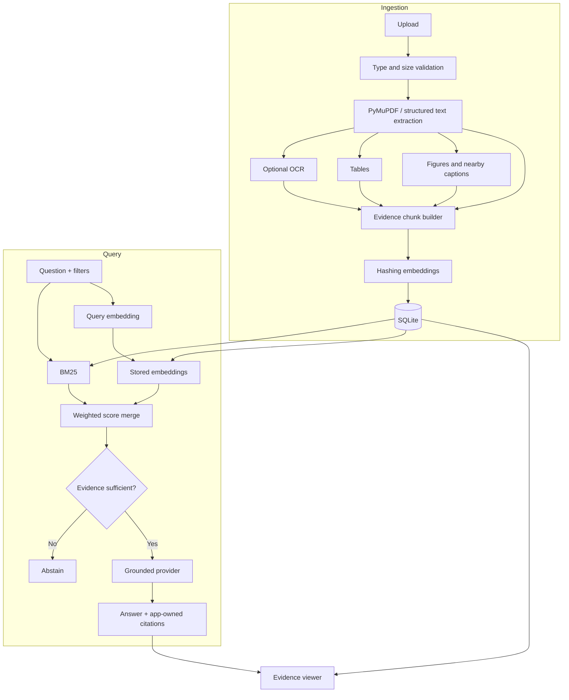

# Technical Documentation

## 1. System purpose

ProofRAG indexes technical maintenance documents and produces evidence-backed responses. The system is designed around a strict boundary: retrieved source records determine what may be said and cited. The answer provider cannot create a citation that does not correspond to an indexed evidence block.

## 2. Functional requirements

- Accept PDF, Markdown, and plain text.
- Preserve document identity, checksum, version, page, source type, and coordinates.
- Extract text blocks, tables, and figure/caption records.
- Optionally OCR pages with little machine-readable text.
- Search selected documents using lexical and vector signals.
- Restrict retrieval by manual version or selected document IDs.
- Abstain below a configurable evidence threshold.
- Attach numbered citations and show original evidence.
- Log the question, response, confidence, abstention status, and cited chunk IDs.

## 3. Non-functional requirements

- Reproducible setup with `uv.lock`.
- No external AI dependency in the default configuration.
- Local storage by default.
- Deterministic baseline behavior.
- Clear failure and warning messages for unsupported or scanned content.
- No automated equipment-control path.

## 4. Architecture



## 5. Component design

### `config.py`

Loads typed `PROOFRAG_*` environment variables through Pydantic Settings. It validates retrieval weights and ensures credentials are supplied if an external answer provider is selected.

### `ingestion.py`

1. Validates extension, content, and upload size.
2. Calculates a SHA-256 checksum and reuses exact duplicates.
3. Saves the source under its content-derived ID.
4. For PDFs, extracts ordered blocks and their page rectangles.
5. Attempts OCR only when configured and a page contains little readable text.
6. Converts detected tables into Markdown while retaining table rectangles.
7. Creates figure records from image rectangles and nearby text.
8. Merges ordinary text blocks to a bounded chunk size with overlap.
9. Embeds and transactionally writes the document and all evidence blocks.

### `embeddings.py`

The MVP uses feature hashing over tokens. It is deterministic, local, and requires no model download. It is best interpreted as a reproducible vector baseline rather than a production semantic encoder. `HashingEmbedder` exposes a narrow `embed`/`cosine` contract so a dense industrial embedding provider can replace it.

### `retrieval.py`

BM25 captures exact terms such as model numbers, fault codes, connectors, and thresholds. The vector path adds soft token-space similarity. Scores are combined using configurable weights:

```text
combined = (bm25_weight × normalized_bm25 + vector_weight × cosine) / total_weight
```

Cosine values are not query-normalized; doing so would make the best irrelevant result appear artificially perfect. Results may be filtered by explicit document selection, exact equipment model, and exact manual version. An empty document selection remains empty rather than silently expanding to the full corpus.

### `answering.py`

Ranking and evidence sufficiency are separate. The evidence gate checks discriminative query-token coverage, exact requested fault/model/connector/number identifiers, absolute cosine support, and model/version applicability. It returns a structured reason such as `weak_support`, `model_mismatch`, `version_mismatch`, or `no_document_selected`.

- `ExtractiveAnswerGenerator` selects the most query-relevant sentences and always attaches source numbers.
- `OpenAICompatibleAnswerGenerator` sends only retrieved excerpts with a strict grounding prompt. Missing/out-of-range citations, uncited content lines, unsupported identifiers/numbers, or incorrect safety ordering trigger extractive fallback. The application creates citation objects only for referenced evidence indices.

### `service.py`

Coordinates retrieval, prunes candidates, applies the evidence decision to the exact bundle available to the answer provider, constructs only referenced citations, adds independent safety warnings, and records a data-minimized query audit entry. Safeguard-bypass requests hard-refuse before procedural generation.

### `api.py`

Exposes health, ingestion, document-listing, questioning, and highlighted-page rendering endpoints. Uploaded PDF pages are rendered on demand; an evidence rectangle is drawn on the in-memory page before producing the PNG response.

### Web interface

The interface intentionally uses static HTML/CSS/JavaScript rather than a second package ecosystem. It supports uploads, corpus selection, equipment/version filters, evidence support (explicitly not a probability), applicability warnings, persistent ingestion warnings, citation cards, demo prompts, and a modal source viewer.

The visual language is a light "technical sheet" built for shop-floor legibility: a graphite status bar (system lamp, document/evidence-block counts, and a permanent synthetic-corpus/not-ABB label), square panels on a gridded canvas, monospace labels for identifiers and page numbers, and colors used only for meaning (amber = safety, green = gate accepted, red = abstention/fault, orange = primary action). After a query, an evidence-gate strip shows the accept/abstain verdict, reason, evidence support, query coverage, and matched/missing identifiers from `EvidenceDecision`. Safety notices render before applicability warnings and the answer; answer sections whose heading mentions safety are drawn as hazard blocks. Inline `[n]` markers become clickable citation chips only when `n` matches an application-owned citation in the response; unknown markers stay plain text. All document and model strings are inserted with `textContent`.

## 6. Data model

### Documents

| Field | Purpose |
|---|---|
| `id` | SHA-256-derived content identity |
| `filename`, `title`, `version`, `equipment_model`, `document_type` | Human and applicability metadata |
| `checksum` | Exact duplicate detection |
| `local_path` | Original evidence source |
| `page_count` | Validation and navigation |
| `metadata_json` | Parser/OCR provenance |

### Evidence chunks

| Field | Purpose |
|---|---|
| `document_id`, `page_number`, `ordinal` | Source location |
| `content`, `normalized_content` | Display and retrieval text |
| `source_type` | Text, table, figure, or OCR |
| `bbox_json` | PDF evidence rectangle |
| `embedding_json` | MVP vector representation |
| `metadata_json` | Block/table/figure details |

### Query audit

Stores a SHA-256 question hash, an explicit non-retention marker instead of answer text, evidence support, abstention, cited chunk IDs, and timestamp. Production deployments still need facility-appropriate retention, access, and privacy policies.

## 7. API examples

### Ingest

```bash
curl -X POST http://127.0.0.1:8000/api/documents \
  -F "file=@manual.pdf" \
  -F "title=Pump Controller Manual" \
  -F "version=2.1" \
  -F "equipment_model=PX-200" \
  -F "document_type=manual"
```

### Ask

```bash
curl -X POST http://127.0.0.1:8000/api/ask \
  -H "Content-Type: application/json" \
  -d '{
    "question": "What must be checked for fault E-17?",
    "equipment_model": "PX-200",
    "manual_version": "1.0"
  }'
```

## 8. Setup and operation

```powershell
uv sync --locked
uv run --locked python scripts/build_demo_pdfs.py
uv run --locked proofrag-seed
uv run --locked proofrag
```

The application defaults to `127.0.0.1:8000`. Runtime state is stored under `data/` and excluded from version control.

## 9. Production scaling path

| Prototype | Production migration |
|---|---|
| Local file storage | Encrypted object storage with immutable source versions |
| SQLite | PostgreSQL for metadata and audit records |
| JSON embeddings | Qdrant or pgvector with filtered ANN search |
| Hashing embedder | Evaluated domain-specific dense embedding model |
| In-process ingestion | Queue-backed workers with antivirus and content scanning |
| Single-node API | Authenticated, autoscaled API with tenant/facility isolation |
| Optional hosted LLM | Approved model gateway with data residency and logging controls |

## 10. Known limitations

- Caption-based figure indexing is not full diagram reasoning.
- The local vector baseline does not understand synonyms as well as a trained encoder.
- Version precedence is user-filtered; automated effective-date rules are future work.
- OCR quality depends on source resolution and host Tesseract availability.
- Evidence support is a deterministic retrieval/support signal, not a probability of correctness; it requires further calibration and domain review.
- The service bulletin behavior is condition-aware for the synthetic demo, but there is no generic automatic precedence policy.

## 11. Future work

- Vision-language descriptions for diagrams with region citations.
- Table-cell-specific evidence coordinates.
- Cross-encoder reranking.
- Automated manual/version applicability resolution.
- Knowledge graph for equipment, components, error codes, and procedural prerequisites.
- Human feedback and citation-correction workflow.
- Offline edge package for field-service laptops.
